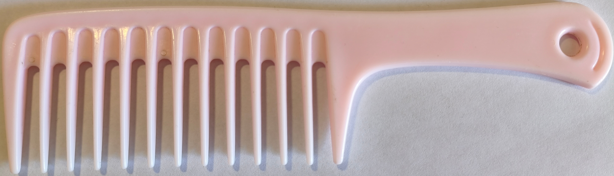
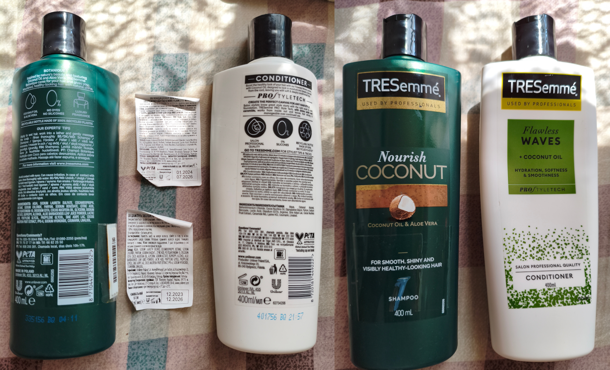

# haircare 
I have curly hair, something in between 2C-2B.  
This info have been accumulated from posts on reddit about my hair:
- [my first one in r/Hair](https://www.reddit.com/r/Hair/comments/1k7hbh3/why_my_hair_wont_stay_together_general_advices/)

# My hair care routine
I use shampoo on my hair only 2 times a week. When using shampoo, I tend to use
as little as possible and mainly apply it to the scalp and let it flow by
itself to the ends. Condition mostly my lower half of hair. The shampoo has to
be silicone free and without any weird chemicals in it, parabens etc. These
silicones etc end up accumulating on the scalp over time giving dandruff and or
oily scalp. Better not to use hot water. Only slightly warm or better a cool
water - works the best. While the conditioner is on, I will use my wide tooth
comb 

and brush from ends to roots. Then I wash it off.

While hair is still kinda wet after drying it with a towel gently, do not rub!
Just pat it dry gently. I apply Jojoba oil to my hair. I do this once a week.
Don't buy products 'with jojoba oil' they have almost none of it in there, just
straight up buy pure jojoba oil. I put a little on a palm and gently
distributes it through hair (mainly from mid length all the way down, as that's
the driest bits). Don't put on scalp, because it will become too oily.

Then I do the "[plopping](https://www.keune.com/hair-plopping/)" and let hair dry naturally.

If I ever need to brush it, I do not brush with a brush. It will create lots of
frizz and ruin waves.

Before getting to sleep, is is good practice to braid hair so it will be
damaged less during sleep.

I cut off a little of my ends every 3 months by myself.

# Things that didn't work for me
Tremese shampoo+conditioner combo:

It was very drying my hair. Had to stop using it.
